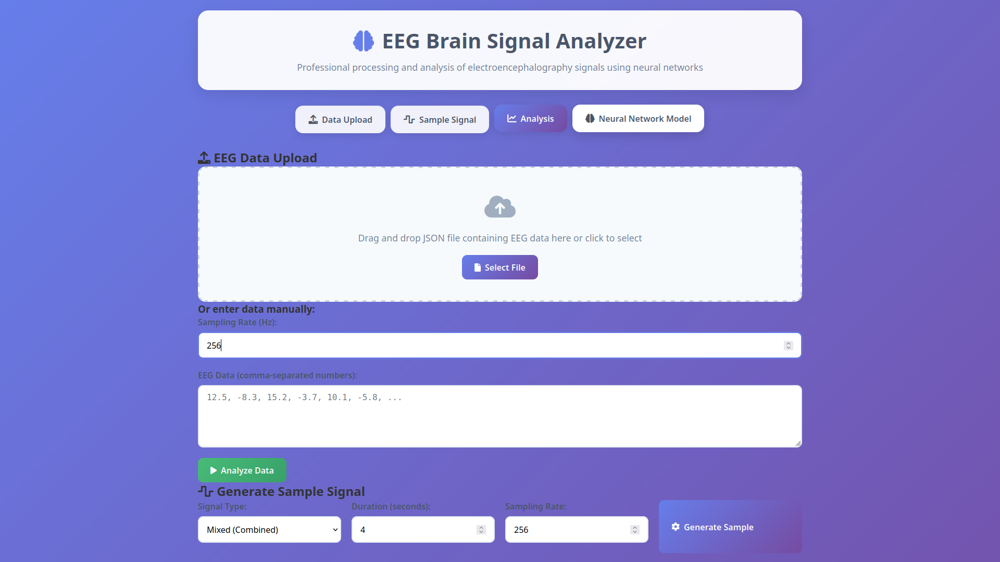
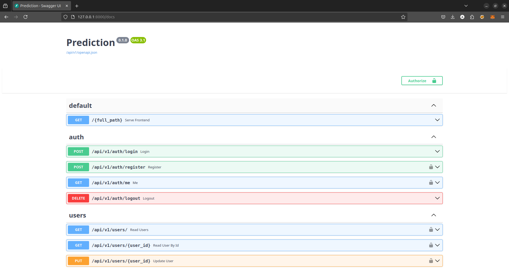

# Full Stack FastAPI-Machine Learning
- prediction electrical activity of the brain between the people drink alcohol and have a depression


## Technology Stack and Features
- 🤖 [**MLops**](https://cloud.google.com/discover/what-is-mlops?hl=en) for deployment and ongoing monitoring and maintenance
    - 📊 [MLflow](https://mlflow.org) for Managing the Machine Learning Lifecycle
    - 🌐 [kubeflow](https://www.kubeflow.org) for machine learning and MLOps on Kubernetes introduced by Google.
    - 📡 [Kubernetes](https://kubernetes.io) software deployment, scaling, and management
    - 🐋 [Docker Compose](https://www.docker.com) for development and production.
- ⚡ [**FastAPI**](https://fastapi.tiangolo.com) for the Python backend API.
    - 🧰 [SQLModel](https://sqlmodel.tiangolo.com) for the Python SQL database interactions (ORM).
    - 🔍 [Pydantic](https://docs.pydantic.dev), used by FastAPI, for the data validation and settings management.
    - 💾 [PostgreSQL](https://www.postgresql.org) as the SQL database.
- 🚀 [React](https://react.dev) for the frontend.
    - 💃 Using TypeScript, hooks, Vite, and other parts of a modern frontend stack.
    - 🎨 [Chakra UI](https://chakra-ui.com) for the frontend components.
    - 🧪 [Playwright](https://playwright.dev) for End-to-End testing.

- 🔒 Secure password hashing by default.
- 🔑 JWT (JSON Web Token) authentication.
- 📫 Email-based password recovery.
- ✅ Tests with [Pytest](https://pytest.org).
- 📞 [Traefik](https://traefik.io) as a reverse proxy/load balancer.
- 🚢 Deployment instructions using Docker Compose, including how to set up a frontend Traefik proxy to handle automatic HTTPS certificates.
- 🏭 CI (continuous integration) and CD (continuous deployment) based on GitHub Actions.

### Model Training 


[check the model](photo/model.png).

### Dashboard




### Interactive API Documentation




## Local Development with Poetry:

[check this page](backend/README.md).

## Dockerized Deployment:

Create an **.env** file on root folder and copy the content from **.env.example**. Feel free to change it according to your own configuration.

## Development guide:

### Run the project using Docker containers and forcing build containers

###  Project structure description:
**docker-compose-dev.yml**: a container for the PostgreSQL and Redis services
- When you want to build the project you should use this file to have dockerized postgres and redis attached to the project.
- To build and run PostgreSQL and Redis should use this command: 
```dockerfile
docker-compose --build 
```
#### Hint:
If you get some errors like 'port already in use' for postgres or redis you can change the external port.

**docker-compose.yml**:
- Main Docker-Compose file for building the service.For running a container after  building PostgreSQL and Redis 
You should run the following command : 
```dockerfile
docker-compose up -d --build
```

## Cache
If you want to use cache in your project, it is better to read its documentation first:
[cache document](backend/app/cache/cache-doc.md)

## Run Test 
Before running other tests, it is recommended to execute the CRUD tests first. 
This ensures the creation of initial data necessary for subsequent tests.

```bash
# Run CRUD tests cd /backend:
pytest tests/crud/
# Run other tests cd /backend:
pytest
```

## TODO List:
- [x] Add Custom Exception handler
- [ ] Add a JSONB field on the table sample
- [x] Add docstrings
- [x] Add Custom Response model
- [ ] Create a sample one-to-many relationship
- [ ] Create a sample many-to-many relationship
- [x] Add Black formatter and flake8 lint
- [ ] Add export report api in CSV/XLSX files using StreamingResponse
- [ ] Convert repo into template using cookiecutter
- [ ] Add tests for APIs
